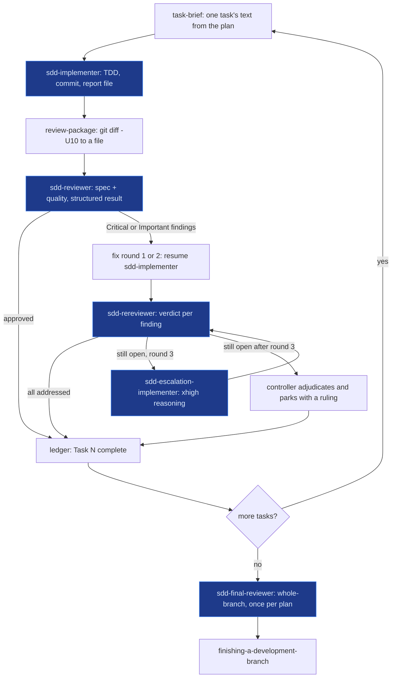
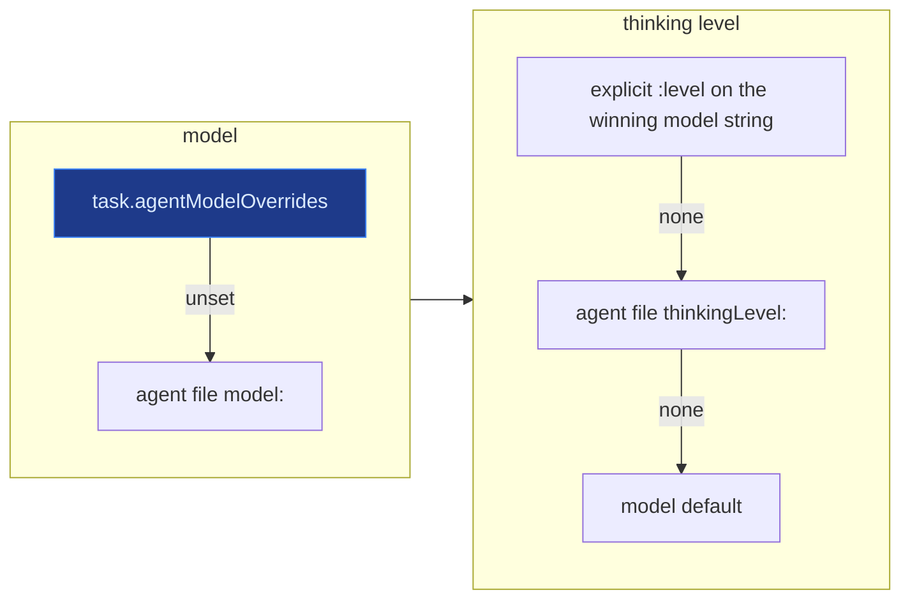

# omp-superpowers

[obra/superpowers](https://github.com/obra/superpowers) adapted for **omp (Oh My Pi)**.

Upstream superpowers is a set of workflow skills (brainstorm → plan → implement via subagents → review → finish). It ships a Pi/omp compatibility layer that is wrong on omp: it tells the agent there is no subagent tool and no todo tool, and its *Model Selection* rules use a `model:` field the omp `task` tool does not have. Under those rules every subagent silently inherits the slowest configured model over the widest tool set — in a real 157-subagent session that was where most of the wall-clock went.

This fork keeps the skills and fixes the omp side:

- the always-injected tool mapping tells the truth about `task`, `todo`, `read`/`grep`/`glob`
- **five omp agents** (`agents/sdd-*.md`) give every subagent-driven-development seat its own model, thinking level, and tool set
- subagent-driven-development is rewritten around them: three-round fix loop, structured reviewer output, waves gated on isolation

## Install

```bash
omp plugin install github:LoneExile/omp-superpowers
```

Pin to a commit when you want reproducibility (the pin is recorded in `~/.omp/plugins/bun.lock`):

```bash
omp plugin install github:LoneExile/omp-superpowers#<sha>
```

Verify it loaded — the roster of your `task` tool should now include the five `sdd-*` agents:

```bash
omp -p --no-session --no-skills --model anthropic/claude-haiku-4-5 \
  'List the agent type names your `task` tool offers, comma-separated, nothing else.'
# scout, reviewer, security-reviewer, sonic, task, sdd-implementer, sdd-reviewer, sdd-rereviewer, sdd-escalation-implementer, sdd-final-reviewer
```

Agent definitions are read **per dispatch**, so a reinstall takes effect on the next `task` call in a running session. The injected tool mapping and the skill catalog are read at process start — restart omp after upgrading to pick those up.

## Using it

The skills drive themselves once loaded. The usual path:

1. `read skill://brainstorming` — turn an idea into a design
2. `read skill://writing-plans` — produce `docs/superpowers/plans/<date>-<name>.md`
3. `read skill://subagent-driven-development` — execute the plan task by task via subagents
4. `read skill://finishing-a-development-branch` — merge / PR / discard

On omp the agent invokes a skill by reading it (`read skill://<name>`); you can also invoke one explicitly with `/skill:<name>`.

### What subagent-driven-development does per task



Blue nodes are the five omp agents this fork ships. A reviewer that cannot read its package yields the `package_gap` verdict value (with what it tried) instead of inventing one, and the controller regenerates and re-dispatches.

### The SDD seats

| Seat | agent | shipped default · thinking | tools |
|---|---|---|---|
| implementer (every task, fix rounds 1–2) | `sdd-implementer` | sonnet-5 · medium | read, write, edit, bash, grep, glob, lsp, ast_grep |
| task reviewer | `sdd-reviewer` | sonnet-5 · high | read, grep, glob |
| scoped re-review | `sdd-rereviewer` | sonnet-5 · low | read, grep |
| fix round 3 / ruled strongest-tier task | `sdd-escalation-implementer` | opus-5 · xhigh | same as implementer |
| final whole-branch review | `sdd-final-reviewer` | opus-5 · xhigh | read, grep, glob, bash, lsp, ast_grep |

The shipped defaults are Anthropic: sonnet for the seats that run on every task, opus for the two that run once per plan or once per stuck task. The tiers are a **thinking ladder** as much as a model ladder — re-reviews reason at `low`, escalation and the final review at `xhigh`.

The two reviewer seats have no `bash`, `edit`, or filesystem `write`: the review package (`git diff -U10` written to a file) is their whole view of the change, and they return a structured result (`spec_compliance`, `task_quality`, `findings[]`, `cannot_verify[]`; `finding_verdicts[]`, `new_breakage[]`, `round_verdict`) plus `package_gap` when they could not read the package. Note the honest boundary: omp always attaches `hub` to subagents, and `hub start` can launch a process, so "no shell" means *cannot edit the tree and cannot run a shell*, not a sandbox.

### Changing models — no file edits

omp resolves each seat's model and thinking level in a fixed order. The override map is the layer meant for you:



Set the override in `~/.omp/agent/config.yml`, or interactively with `/agents` in any session (it edits the same map). It applies on the next dispatch; delete a line to fall back to the agent file.

This is how the fork's own author runs it — every seat on a flat-rate model, mapped onto that model's own thinking ladder:

```yaml
task:
  agentModelOverrides:
    sdd-implementer: opencode-go/deepseek-v4.1-flash:high
    sdd-reviewer: opencode-go/deepseek-v4.1-flash:high
    sdd-rereviewer: opencode-go/deepseek-v4.1-flash:low
    sdd-escalation-implementer: opencode-go/deepseek-v4.1-flash:max
    sdd-final-reviewer: opencode-go/deepseek-v4.1-flash:max
```

**Use the exact catalog id and a level the model actually offers.** `omp models ls <provider>` shows each model's ladder. A level that is not on it is silently clamped to the nearest valid one — `deepseek-v4.1-flash` offers only `low, high, max`, so `:medium` would run at `low` and `:xhigh` at `high`, collapsing the ladder without any error. Check `session_init.resolvedModel` in a subagent transcript if in doubt: it shows the level that actually ran. Catalog ids also get renamed (this one was `deepseek-flash` a day earlier, and the old string now matches an empty placeholder row).

Measured on a real fix-round re-review with identical inputs: a grok-4.6 seat took 9.7 min / 4 turns, sonnet-5 about 50 s / 1 turn, the DeepSeek flash seat 100 s / 4 turns — same verdict, full structured result, all three.

Rules that are easy to get wrong:

- A **bare model** (`anthropic/claude-haiku-4-5`) keeps the agent file's own `thinkingLevel`. Add `:level` (`…:high`) to change reasoning too.
- **Delete a line** to fall back to the agent file's default for that seat. Overrides apply on the next dispatch — no restart.
- The `task` tool has **no `model:` field**. Never dispatch the bundled `task` or `reviewer` agent for an SDD seat — they resolve to `modelRoles.task` / `@slow`, which on many hosts is a cheap model.
- `effort` on a dispatch (when `task.enableEffort` is on) accepts only `"lo"`, `"med"`, `"hi"`.
- Discovery-only model ids (the OpenCode Go catalog, for example) accept `:level` in config and in overrides but not on the `--model` CLI flag.

### Optional settings that matter

| setting | why |
|---|---|
| `task.isolation.enabled` (+ `isolation.backend`, default `auto`) | off by default; SDD only runs implementers in **parallel waves** when it is on — otherwise they share one checkout and stay serial. Older omp builds spelled this `task.isolation.mode`; check `omp config get task.isolation.enabled` on your build |
| `task.enableEffort` | exposes per-dispatch `effort` for the round-3 escalation |
| `autolearn.autoContinue` | omp's auto-learn mints managed skills every session; the whole catalog is injected into every subagent's prompt. Keep it pruned or off — a 2,500-skill catalog was ~220k tokens per subagent turn |

## What changed from upstream

- `.pi/extensions/superpowers.ts` — the injected mapping names `task`, `todo`, the `sdd-*` roster, and the no-`model:`-field rule
- `skills/using-superpowers/references/pi-tools.md` — same, as the reference doc
- `agents/sdd-*.md` — new
- `skills/subagent-driven-development/` — *Model Selection* → *Agent Selection*; fix-loop cap 5 → 3 with a round-3 escalation seat; a proven-trivial-fix route that replaces a re-review with a one-command proof; waves keyed to the plan's pre-flight file/interface table and gated on isolation; templates show omp's real `{ context, tasks: [{ agent, task }] }` wire shape and the reviewers' structured fields
- `skills/using-git-worktrees/` — additive omp section: `/wt` is the user's one-line answer to the consent question (moves the session, carries WIP); when the agent creates the worktree itself it uses `omp worktree add` under `~/.omp/wt/` (the only place `omp worktree list`/`clear` manage), knows that command leaves uncommitted changes behind, and asks for `/move <path>` because `cd` never moves the tools' cwd
- `README.md` — this file: rewritten for omp (install, seats, overrides, maintenance); upstream's multi-harness README is gone
- `tests/pi/test-pi-extension.mjs` — one assertion follows the renamed mapping heading

Everything else is upstream, unmodified.

## Maintenance

```bash
git fetch upstream
git rebase upstream/main
git push --force-with-lease origin main
omp plugin install github:LoneExile/omp-superpowers#$(git rev-parse --short HEAD)
(cd ~/.omp/plugins && npm install --package-lock-only --ignore-scripts)   # keep package-lock in step with bun.lock
```

Expect conflicts in `skills/subagent-driven-development/`, `pi-tools.md`, and `README.md` whenever upstream touches them — this fork rewrites those files rather than appending to them (README.md is never a partial conflict). `agents/`, the extension's mapping paragraph, and the omp blocks in `using-git-worktrees` are additive.

Before trusting a new omp release, re-check the harness facts this fork depends on — against the **running binary**, not the npm source tree. `~/.bun/install/global/node_modules/@oh-my-pi/pi-coding-agent/src` routinely lags `omp --version` (a 17.4.2 tree sat beside an 18.1.17 binary while this README was written, and the isolation setting had been renamed in between). The live oracles are `omp config list --json` (every setting and its default), the `task` tool's own description in a session (agent roster, item fields), a `session_init.resolvedModel` line in a subagent transcript (what actually resolved), and `grep -a` on the binary for an exact string when you need to know whether a code path exists.

## License

MIT, inherited from upstream. Not affiliated with obra / Prime Radiant.
