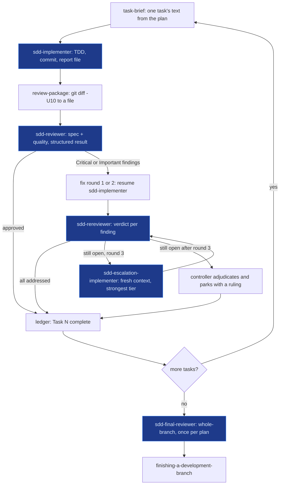
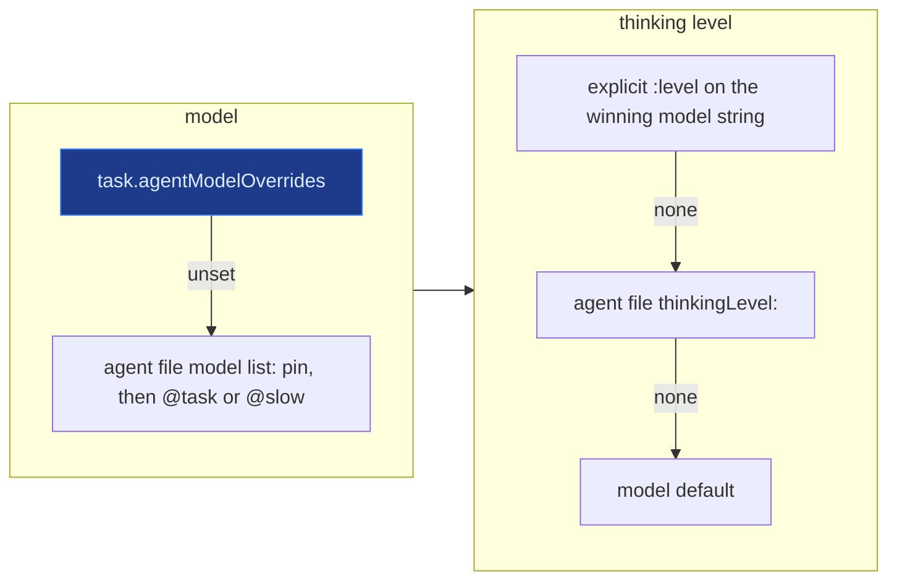

# omp-superpowers

[obra/superpowers](https://github.com/obra/superpowers) adapted for **omp (Oh My Pi)**.

Upstream superpowers is a set of workflow skills (brainstorm → plan → implement via subagents → review → finish). It ships a Pi/omp compatibility layer that is wrong on omp: it tells the agent there is no subagent tool and no todo tool, and its *Model Selection* rules use a `model:` field the omp `task` tool does not have. Under those rules every subagent silently inherits the slowest configured model over the widest tool set — in a real 157-subagent session that was where most of the wall-clock went.

This fork keeps the skills and fixes the omp side:

- the injected tool mapping tells the truth about `task`, `todo`, `read`/`grep`/`glob`
- **five omp agents** (`agents/sdd-*.md`) give every subagent-driven-development seat its own model, thinking level, and tool set
- subagent-driven-development is rewritten around them: three-round fix loop, structured reviewer output, implementers one at a time

## Install

```bash
omp plugin install npm:@loneexile/omp-superpowers
```

Releases are versioned `<upstream version>-omp.<n>`: `6.4.2-omp.1` is upstream v6.4.2 plus this fork's first iteration on it. [CHANGELOG.md](CHANGELOG.md) lists each release. To move to another one, uninstall and install it pinned:

```bash
omp plugin uninstall @loneexile/omp-superpowers
omp plugin install npm:@loneexile/omp-superpowers@<version>
```

Unreleased `main` installs from GitHub under the same plugin name, pinned to a commit: `omp plugin install github:LoneExile/omp-superpowers#<sha>`. Installs made before 6.4.2-omp.1 used the plugin name `superpowers`; run `omp plugin uninstall superpowers` before installing this package.

npm and `github:` installs keep each seat's model. For a marketplace or `--plugin-dir` install of the repo root, the repo carries `.omp-plugin/plugin.json`: omp 18.4.10's agent discovery treats a root that has `.claude-plugin/plugin.json` as Claude dialect, and drops every agent's `model:` line, unless that file is present. This was read from omp's source; a marketplace install has not been exercised.

Verify it loaded — the roster of your `task` tool should now include the five `sdd-*` agents:

```bash
omp -p --no-session --no-skills --model anthropic/claude-haiku-4-5 \
  'List the agent type names your `task` tool offers, comma-separated, nothing else.'
# scout, reviewer, security-reviewer, sonic, task, sdd-implementer, sdd-reviewer, sdd-rereviewer, sdd-escalation-implementer, sdd-final-reviewer
```

Agent definitions are read **per dispatch**, so a reinstall takes effect on the next `task` call in a running session. The injected tool mapping and the skill catalog are read at process start — restart omp after upgrading to pick those up. The bootstrap is injected at the start of each session, including `/new`, `/resume` and `/fork`, until that session's first agent run ends, and again after compaction. Main session only; subagents never get it.

## Using it

The skills drive themselves once loaded. The usual path:

1. `read skill://brainstorming` — turn an idea into a design
2. `read skill://writing-plans` — produce `docs/superpowers/plans/<date>-<name>.md`
3. `read skill://subagent-driven-development` — execute the plan task by task via subagents. If you choose Native at the plan handoff, `executing-plans` runs instead: the session does every task itself, and only the final review is a subagent (`sdd-final-reviewer`)
4. `read skill://finishing-a-development-branch` — merge / PR / discard

On omp the agent invokes a skill by reading it (`read skill://<name>`); you can also invoke one explicitly with `/skill:<name>`.

**Vibe mode.** After `/vibe` the session is a director of `fast`/`good` workers and has no `task`, `bash` or file-writing tool, so it cannot run subagent-driven-development or executing-plans itself. Both skills tell it to hand the whole run to one `good` worker, which dispatches the `sdd-*` seats through its own `task` tool. Vibe refuses `/move` and `/wt`, so create the worktree and `/move` into it first; for a long plan set `task.softRequestBudget: 0`. Details are in the *Vibe mode* section of [`pi-tools.md`](skills/using-superpowers/references/pi-tools.md).

### What subagent-driven-development does per task


```mermaid
flowchart TD
    B["task-brief: one task's text from the plan"] --> I
    I["sdd-implementer: TDD, commit, report file"] --> P["review-package: git diff -U10 to a file"]
    P --> R["sdd-reviewer: spec + quality, structured result"]
    R -->|"approved"| D["ledger: Task N complete"]
    R -->|"Critical or Important findings"| F
    F["fix round 1 or 2: resume sdd-implementer"] --> RR["sdd-rereviewer: verdict per finding"]
    RR -->|"all addressed"| D
    RR -->|"still open, round 3"| E["sdd-escalation-implementer: fresh context, strongest tier"]
    E --> RR
    RR -->|"still open after round 3"| A["controller adjudicates and parks with a ruling"]
    A --> D
    D --> N{"more tasks?"}
    N -->|"yes"| B
    N -->|"no"| W["sdd-final-reviewer: whole-branch, once per plan"]
    W --> X["finishing-a-development-branch"]

    classDef seat fill:#1e3a8a,stroke:#3b82f6,color:#dbeafe
    class I,R,RR,E,W seat
```

Blue nodes are the five omp agents this fork ships. A reviewer that cannot read its package yields the `package_gap` verdict value (with what it tried) instead of inventing one, and the controller regenerates and re-dispatches.

### The SDD seats

| Seat | agent | shipped default · thinking | falls back to | tools |
|---|---|---|---|---|
| implementer (every task, fix rounds 1–2) | `sdd-implementer` | claude-sonnet-5-5 · medium | `@task` | read, write, edit, bash, grep, glob, lsp, ast_grep |
| task reviewer | `sdd-reviewer` | claude-sonnet-5-5 · high | `@task` | read, grep, glob |
| scoped re-review | `sdd-rereviewer` | claude-sonnet-5-5 · low | `@task` | read, grep |
| fix round 3 / ruled strongest-tier task | `sdd-escalation-implementer` | claude-opus-5-5 · max | `@slow` | same as implementer |
| final whole-branch review (subagent-driven or Native) | `sdd-final-reviewer` | claude-opus-5-5 · max | `@slow` | read, grep, glob, bash, lsp, ast_grep |

`lsp` and `ast_grep` are listed for the seats that benefit, but omp only activates them in subagents when `task.enableLsp` / `astGrep.enabled` are on (both default off).

omp takes the first list entry whose provider has credentials. If the pin has none, the seat runs on your `modelRoles.task` / `modelRoles.slow` model at that role's own level. An unset `@task` drops out, and the seat then silently runs on the controller's model; an unset `@slow` expands to omp's built-in strong-model ranking. The list is also the retry chain on rate-limit and usage-limit errors, gated by `retry.modelFallback` (default on); there is no switch on context overflow. Turn on `task.showResolvedModelBadge`, or read `session_init.resolvedModel` in a subagent transcript, to see what actually ran.

The shipped defaults are Anthropic: sonnet for the seats that run on every task, opus for the two that run once per plan or once per stuck task. The tiers are a **thinking ladder** as much as a model ladder — re-reviews reason at `low`, escalation and the final review at `max`.

The two reviewer seats have no `bash`, `edit`, or filesystem `write`: the review package (`git diff -U10` written to a file) is their whole view of the change, and they return a structured result (`spec_compliance`, `task_quality`, `findings[]`, `cannot_verify[]`; `finding_verdicts[]`, `new_breakage[]`, `round_verdict`) plus `package_gap` when they could not read the package. Note the honest boundary: an agent's `tools:` list limits built-in tools only. Extension tools and MCP tools (mounted as `xd://` devices and run through a device-only `write`) still attach to every subagent; memory tools attach only when the agent's `tools:` list names them. On omp 18.4.10 a read/grep/glob reviewer ran a shell command through an MCP device. Read-only is by instruction, not a sandbox.

### Changing models — no file edits

omp resolves each seat's model and thinking level in a fixed order. The override map is the layer meant for you:


```mermaid
flowchart LR
    subgraph model["model"]
        M1["task.agentModelOverrides"] -->|"unset"| M2["agent file model list: pin, then @task or @slow"]
    end
    subgraph level["thinking level"]
        L1["explicit :level on the winning model string"] -->|"none"| L2["agent file thinkingLevel:"]
        L2 -->|"none"| L3["model default"]
    end
    model --> level

    classDef you fill:#1e3a8a,stroke:#3b82f6,color:#dbeafe
    class M1 you
```

Set the override in `~/.omp/agent/config.yml`, or interactively with `/agents` in any session (it edits the same map). It applies on the next dispatch; delete a line to fall back to the agent file.

Example — every seat on one flat-rate model, mapped onto that model's own thinking ladder:

```yaml
task:
  agentModelOverrides:
    sdd-implementer: opencode-go/deepseek-v4.1-flash:high
    sdd-reviewer: opencode-go/deepseek-v4.1-flash:high
    sdd-rereviewer: opencode-go/deepseek-v4.1-flash:low
    sdd-escalation-implementer: opencode-go/deepseek-v4.1-flash:max
    sdd-final-reviewer: opencode-go/deepseek-v4.1-flash:max
```

**Use the exact catalog id and a level the model actually offers.** `omp models ls <provider>` shows each model's ladder. A level that is not on it is silently clamped to the nearest valid one — `deepseek-v4.1-flash` offers only `low, high, max`, so `:medium` would run at `low` and `:xhigh` at `high`, collapsing the ladder without any error. Check `session_init.resolvedModel` in a subagent transcript if in doubt: it shows the level that actually ran. Catalog ids also get renamed (this one was `deepseek-flash` a day earlier, and the old string now matches an empty placeholder row).

Measured on a real fix-round re-review with identical inputs: a grok-4.6 seat took 9.7 min / 4 turns, sonnet-5 about 50 s / 1 turn, the DeepSeek flash seat 100 s / 4 turns — same verdict, full structured result, all three.

Rules that are easy to get wrong:

- A **bare model** (`anthropic/claude-haiku-4-5`) keeps the agent file's own `thinkingLevel`. Add `:level` (`…:high`) to change reasoning too.
- **Delete a line** to fall back to the agent file's default for that seat. Overrides apply on the next dispatch — no restart.
- An override **replaces the whole model list**, fallback included. Append `,@task` (for example `provider/model:high,@task`) to keep one.
- The `task` tool has **no `model:` field**. Never dispatch the bundled `task` or `reviewer` agent for an SDD seat — they lack the seat's tools, structured output and no-subagent rule, and run whatever `modelRoles.task` / `modelRoles.slow` names.
- `effort` on a dispatch (when `task.enableEffort` is on) accepts only `"lo"`, `"med"`, `"hi"`. `"hi"` maps to the model's top supported level, capped by `task.maxEffort`; SDD uses `effort: "hi"` for high-risk task reviews, and for escalation only when a host override lowers that seat.
- Discovery-only model ids (the OpenCode Go catalog, for example) accept `:level` in config and in overrides but not on the `--model` CLI flag.

### Optional settings that matter

| setting | why |
|---|---|
| `task.isolation.enabled` (+ `isolation.backend`, default `auto`) | off by default. SDD does not use it: implementers run one at a time, because isolated work returns as an applied patch with no per-task commits, and an isolated subagent cannot be messaged for fix rounds. Older omp builds spelled this `task.isolation.mode`; check `omp config get task.isolation.enabled` on your build |
| `task.enableEffort` | exposes per-dispatch `effort` (`"lo"`, `"med"`, `"hi"`); `"hi"` maps to the model's top supported level, capped by `task.maxEffort`. SDD uses `effort: "hi"` for high-risk task reviews, and for escalation only when a host override lowers that seat |
| `task.showResolvedModelBadge` (default off) | shows the model each subagent actually ran. A seat whose pinned provider has no credentials silently runs on another model |
| `task.enableLsp`, `astGrep.enabled` (both default off) | omp only activates `lsp` and `ast_grep` in subagents when these are on |
| `autolearn.autoContinue` | omp's auto-learn mints managed skills every session; the whole catalog is injected into every subagent's prompt. Keep it pruned or off — a 2,500-skill catalog was ~220k tokens per subagent turn |

## What changed from upstream

- `.pi/extensions/superpowers.ts` — the injected mapping names `task`, `todo`, the `sdd-*` roster, and the no-`model:`-field rule; it also re-arms on `session_switch`, skips subagent sessions, and ignores an `agent_end` that will auto-continue; its last paragraph points a vibe-mode director (tools include `vibe_spawn` but not `task`) at the *Vibe mode* section of `pi-tools.md`
- `.omp-plugin/plugin.json` — new. Marks the repo root as an omp-native plugin so a marketplace or `--plugin-dir` install keeps each agent's `model:` line
- `skills/using-superpowers/references/pi-tools.md` — same, as the reference doc; it also gains a *Vibe mode* section: what a director keeps and lacks, how skill actions map onto `vibe_*` and workers, and the worktree and request-budget limits
- `agents/sdd-*.md` — new. Each seat's `model:` is a pin plus a role fallback (`@task` or `@slow`), and all set `readSummarize: false`. `sdd-final-reviewer` reviews the whole branch for both ways of running a plan. It reads `requesting-code-review/code-reviewer.md` at run time and applies its What to Check, Calibration, severity definitions and Critical Rules, while carrying upstream's vision-document and Declined-to-judge rules in its own body. Descriptions name roles, never models
- `skills/subagent-driven-development/` — *Model Selection* → *Agent Selection*; fix-loop cap 5 → 3 with a round-3 escalation seat; a proven-trivial-fix route that replaces a re-review with a one-command proof; implementers run one at a time; the scripts directory resolves via `realpath skill://subagent-driven-development/scripts`; fix rounds resume the implementer with `write agent://<id>` (id ledgered) and full results are read at `agent://<id>`; task review scales with risk through `effort: "hi"`; the controller checks reviewer results; templates show omp's real `{ context, tasks: [{ agent, task, solutionSpace }] }` wire shape and the reviewers' structured fields; one omp paragraph for vibe mode, where a director (no `task` or `bash`) hands the whole run to one `good` worker that dispatches the seats itself
- `skills/executing-plans/` — one additive omp paragraph in *Final Review*: the `task` tool has no `model:` field, so the final review goes to `sdd-final-reviewer` (its model is what the host maps that agent to), told that no task was reviewed; it also resolves the scripts directory with `realpath` and reads full results at `agent://<id>`; one more omp paragraph for vibe mode, where a director hands the whole run to one `good` worker
- `skills/using-git-worktrees/` — additive omp section: `/wt` is the user's one-line answer to the consent question (moves the session, carries WIP); when the agent creates the worktree itself it uses `omp worktree add` under `~/.omp/wt/` (the only place `omp worktree list`/`clear` manage), knows that command leaves uncommitted changes behind, and asks for `/move <path>` because `cd` never moves the tools' cwd. Also: clone-first falls back to a plain checkout without `node_modules` (no copy-on-write, or in-repo targets); setup and tests use the bash tool's `cwd` parameter until `/move`; `omp worktree clear --all` is warned against, since it force-removes every worktree, uncommitted work included; omp's bash rewrites a literal `git worktree add` into `omp worktree add` only without shell expansion; vibe mode refuses `/move` and `/wt`, so the worktree and `/move` come before `/vibe`, or every worker brief carries the absolute path
- `skills/writing-plans/` — one added line in *Execution Handoff*: in vibe mode both execution approaches run in one `good` worker the director briefs, not in its own session
- `README.md` — this file: rewritten for omp (install, seats, overrides, maintenance); upstream's multi-harness README is gone
- `tests/pi/test-pi-extension.mjs` — covers the extension's lifecycle (bootstrap on start, `session_switch`, compaction; none for subagents or an auto-continuing `agent_end`), the action table in `pi-tools.md`, the seat table against the names in `agents/*.md`, and the `.omp-plugin/plugin.json` manifest; the package-name assertion is gone (`scripts/check-npm-package.sh` checks the published name)
- `package.json` — the npm identity: `@loneexile/omp-superpowers`, `<upstream version>-omp.<n>` versions, a `files` allowlist (the extension, `skills/`, `agents/`), `publishConfig`, `omp`/`oh-my-pi` keywords; `main` is dropped, since it pointed at the OpenCode plugin this package does not ship
- `CHANGELOG.md`, `.github/workflows/` (CI, npm release), `scripts/check-npm-package.sh` — new

Everything else is upstream, unmodified.

## Maintenance

### Syncing with upstream

```bash
git fetch upstream --tags
git rebase upstream/main
git push --force-with-lease origin main
```

Expect conflicts in `skills/subagent-driven-development/`, `pi-tools.md`, `README.md`, and `package.json` whenever upstream touches them — this fork rewrites those files rather than appending to them (README.md is never a partial conflict). In `package.json` keep the fork's identity and set `version` to `<new upstream version>-omp.1`: CI's package check fails until the version's base matches the upstream version in `.claude-plugin/plugin.json`. `agents/`, the extension's mapping paragraph, and the omp blocks in `using-git-worktrees` are additive.

A clean rebase is not the whole sync. Upstream's edits to text this fork replaced never reach the replacement, so read upstream's diff for those files and port what still applies. The v6.4.x sync needed two: `bash scripts/...` invocations in the SDD text, and `code-reviewer.md`'s new review rules. Upstream edits to `code-reviewer.md`'s What to Check, Calibration, severity definitions and Critical Rules now reach `sdd-final-reviewer` without porting, because it reads the file at run time. Edits to the vision-document or Declined-to-judge sections still need porting into the agent body, which carries them itself.

### Releasing

1. Set `version` in `package.json`, move CHANGELOG.md's *Unreleased* entries under that version, commit, push, and wait for CI.
2. Publish a GitHub release for the tag `v<version>`; the [release workflow](.github/workflows/release.yml) publishes it to npm through Trusted Publishing, with provenance:

```bash
v=$(node -p "require('./package.json').version")
awk -v h="## [$v]" 'index($0, h) == 1 {f = 1; next} f && /^(## )?\[/ {exit} f' CHANGELOG.md > /tmp/notes.md
gh release create "v$v" --target main --title "v$v" --notes-file /tmp/notes.md
```

### New omp versions

Before trusting a new omp release, re-check the harness facts this fork depends on — against the **running binary**, not an npm source tree that may lag it. `~/.bun/install/global/node_modules/@oh-my-pi/pi-coding-agent/src` routinely lags `omp --version` (a 17.4.2 tree sat beside an 18.1.17 binary while this README was written, and the isolation setting had been renamed in between). The fork was last verified against omp 18.4.10. To read the exact running version's source, pack it into a temp dir: `cd "$(mktemp -d)" && npm pack @oh-my-pi/pi-coding-agent@$(omp --version | cut -d/ -f2) && tar xzf *.tgz` (source under `package/src`). The live oracles are `omp config list --json` (every setting and its default), the `task` tool's own description in a session (agent roster, item fields), a `session_init.resolvedModel` line in a subagent transcript (what actually resolved), and `grep -a` on the binary for an exact string when you need to know whether a code path exists.

## License

MIT, inherited from upstream. Not affiliated with obra / Prime Radiant.
