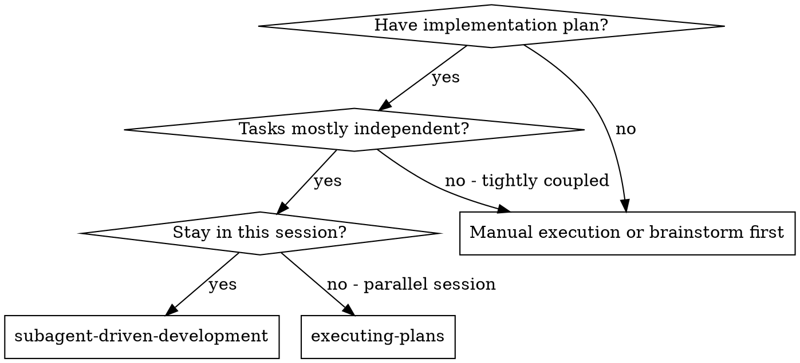
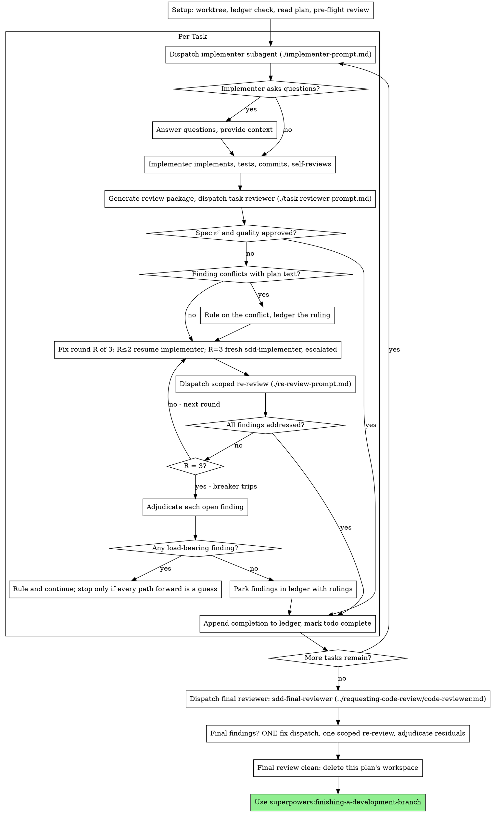

# Subagent-Driven Development

Execute plan by dispatching a fresh implementer subagent per task, a task review (spec compliance + code quality) after each, and a broad whole-branch review at the end.

**Why subagents:** You delegate tasks to specialized agents with isolated context. By precisely crafting their instructions and context, you ensure they stay focused and succeed at their task. They should never inherit your session's context or history — you construct exactly what they need. This also preserves your own context for coordination work.

**Core principle:** Fresh subagent per task + task review (spec + quality) + broad final review = high quality, fast iteration

**Narration:** between tool calls, narrate at most one short line — the
ledger and the tool results carry the record.

**Continuous execution:** Do not pause to check in with your human partner between tasks. Execute all tasks from the plan without stopping. The only reasons to stop are the four named below, or all tasks complete. "Should I continue?" prompts and progress summaries waste their time — they asked you to execute the plan, so execute it.

**Rulings, not stalls.** A running plan does not wait on a human. Conflicts,
ambiguities, plan defects, a cap you would have asked to exceed — decide
them. The spec is the binding authority, the plan is its argument, and your
judgment settles what neither answers. Record every decision in the ledger as
`Ruling: <what you decided> — <why> — <what it costs if wrong>`, and keep
going. A wrong ruling costs rework your human partner can see and undo; a
session parked on a question costs their whole day and buys nothing.

Four things stop you, and only these: an irreversible or destructive
operation; a security-sensitive action; a side effect outside this worktree
that norms say you ask about first (a merge, a push to a shared branch, a
publish); and a plan so broken that every path forward is a guess. For those,
stop and ask.

## When to Use



**vs. Executing Plans (parallel session):**
- Same session (no context switch)
- Fresh subagent per task (no context pollution)
- Review after each task (spec compliance + code quality), broad review at the end
- Faster iteration (no human-in-loop between tasks)

## The Process



## Setup

Ensure the work happens in an isolated workspace: use
superpowers:using-git-worktrees to create one or verify the existing one.
Never start implementation on a main/master branch without your human
partner's explicit consent.

Conversation memory does not survive compaction. In real sessions,
controllers that lost their place have re-dispatched entire completed task
sequences — the single most expensive failure observed. Track progress in
a ledger file, not only in todos.

- Each plan owns a workspace: at skill start, run this skill's
  `scripts/sdd-workspace PLAN_FILE` — it prints the plan's git-ignored
  directory (`<repo-root>/.superpowers/sdd/<plan-basename>/`), home to
  every artifact for THIS plan: ledger, briefs, reports, review packages.
  Another plan's directory is never yours to read or write.
- Check for this plan's ledger at `<workspace>/progress.md`. If its first
  line names your plan file, tasks with a `Task <N>: complete` line are DONE
  — do not re-dispatch them; resume at the first task without one. A task
  whose last line is a fix round is mid-loop: resume the loop at the next
  round. A ledger whose first line names a different plan file — or a stray
  ledger at the old flat path `.superpowers/sdd/progress.md` — is another
  plan's progress: leave it in place and start your own, fresh.
- Create the ledger with its identity as the first line:
  `# SDD ledger — plan: <plan file path>`.
- The ledger is your recovery map: the commits it names exist in git even
  when your context no longer remembers creating them. After compaction,
  trust the ledger and `git log` over your own recollection.
- `git clean -fdx` will destroy the workspace (it's git-ignored scratch); if
  that happens, recover from `git log`.

Read the plan once, note its context and Global Constraints, and create a
todo per task. If the plan names a Spec, read that too: the spec is the
authority the plan argues from, and conflicts inside the plan resolve
against it. A plan with no reachable spec gets a ledger note saying so —
rulings made without one are provisional.

Before dispatching Task 1, scan the plan once for conflicts, writing down
what you checked as you check it:

- tasks that contradict each other or the plan's Global Constraints
- anything the plan explicitly mandates that the review rubric treats as a
  defect (a test that asserts nothing, verbatim duplication of a logic block)

The scan's output is a table, not a verdict. One row for every pair of tasks
that share a file or an interface: the two tasks, what one produces against
what the other consumes, and what you found. One row for every task: whether
its own text agrees with itself — the tests it specifies against the code it
specifies, the files it creates against the files it later touches. "The scan
is clean" without those rows is not a scan you ran.

Write the table to the ledger. Rule on everything you find before execution
begins — each finding against the plan text that mandates it — and record
each ruling in the ledger. If the scan is clean, proceed without comment.
Rule on each conflict it surfaces — the spec is the binding authority, the
plan is its argument — record the ruling beside its row, and dispatch
Task 1. The review loop remains the net for conflicts that only emerge from
implementation.

## Agent Selection

On omp the `task` tool has no `model:` field — the agent TYPE carries the
model, the thinking level, and the tool set. This fork ships five SDD
agents (`agents/sdd-*.md`); they appear in the `task` tool's own roster.
**Always dispatch SDD work with one of them.** The bundled `task` agent
resolves to whatever `modelRoles.task` is configured to (else the session
model) and the bundled `reviewer` to `@slow` — in a real 157-subagent
session both were the slowest tier over the widest tool set, which is where
most of the wall-clock went.

| Role | `agent:` | Tier | Tools |
|---|---|---|---|
| Implementer (every task, fix rounds 1-2) | `sdd-implementer` | mid (sonnet-class) | edit/test set, no subagents |
| Fix round 3 | `sdd-escalation-implementer` | most capable (`@slow`) | same as implementer |
| Task reviewer | `sdd-reviewer` | mid, higher reasoning | `read`, `grep`, `glob` only — diff-only review by construction |
| Scoped re-review | `sdd-rereviewer` | cheapest sonnet tier (1M window), haiku fallback | `read`, `grep`; ≤4 tool calls (a justified fifth is allowed) |
| Final whole-branch review | `sdd-final-reviewer` | most capable (`@slow`) | read-only + focused bash |

`@slow` is omp's designated most-capable role (`modelRoles.slow`); the two
seats that use it are the ones that run once per plan or once per stuck
task, so its cost is bounded.

**Turn count beats token price.** Wall-clock scales with how many turns a
subagent takes; the cheapest models routinely take 2-3× the turns on
multi-step work. Mid-tier is the floor for implementers and task reviewers.
Re-reviews are verdict-only work over a small diff — the cheapest tier
whose context window absorbs the package is correct for them, not a
compromise.

**Escalation (fix round 3):** the implementer that got stuck cannot see its
own problem. Dispatch a FRESH `sdd-escalation-implementer` with the
framing below. If `task.enableEffort` is on you may add `effort: "hi"`
(the only accepted values are `"lo"`, `"med"`, `"hi"`) to raise thinking
further; it is optional — the agent's own tier is the escalation.

**Override, never omit.** If a task genuinely needs the strongest tier for
its first implementation (design judgment across many files), say so in
the ledger as a ruling and dispatch `sdd-escalation-implementer` for it;
the default remains `sdd-implementer`. Never reach for the bundled `task`
agent for an SDD seat — its tier is whatever the session configured.

## The Task Loop

**Batch small same-shape work.** When the plan lists several tasks that are
each a small, independent edit of the same kind — the same one-line fix,
constant change, or field addition repeated across files — do not dispatch
one subagent per task. Compose ONE dispatch brief listing every file and
its change, send the whole batch to a single subagent, and review its diff
as one unit. Reserve one-dispatch-per-task for work that needs its own
judgment, its own tests, or its own review surface.

Everything you paste into a dispatch prompt — and everything a subagent
prints back — stays resident in your context for the rest of the session
and is re-read on every later turn. Hand artifacts over as files.

**Waiting on dispatched subagents:** never poll a wait interface with
short timeouts, and never sit in one silent, open-ended wait either.
While you have local work — ledger updates, packaging the next review,
reading reports — keep working; child results arrive on their own.
When you are genuinely idle, wait in bounded stretches (five to ten
minutes, where your platform allows), and between stretches post one
line of status and reconcile your live children: list them, and chase
any that finished without reporting. A bounded stretch keeps nearly
all of a long wait's efficiency while guaranteeing a stuck or lost
child is noticed within minutes, not at the end of the session.

### 1. Dispatch the implementer

Record BASE (`git rev-parse HEAD`) before dispatching — the review package
and fix-round diffs need it.

- **Task brief:** before dispatching an implementer, run this skill's
  `scripts/task-brief PLAN_FILE N` — it extracts the task's full text to a
  uniquely named file and prints the path. Compose the dispatch so the
  brief stays the single source of
  requirements. Your dispatch should contain: (1) one line on where this
  task fits in the project; (2) the brief path, introduced as "read this
  first — it is your requirements, with the exact values to use verbatim";
  (3) interfaces and decisions from earlier tasks that the brief cannot
  know; (4) your resolution of any ambiguity you noticed in the brief;
  (5) the report-file path and report contract. Exact values (numbers,
  magic strings, signatures, test cases) appear only in the brief. Never
  make a subagent read the whole plan file.
- **Report file:** name the implementer's report file after the brief
  (brief `…/task-N-brief.md` → report `…/task-N-report.md`) and put it in
  the dispatch prompt. The implementer writes the full report there and
  returns only status, commits, a one-line test summary, and concerns.
- A dispatch prompt describes one task, not the session's history. Do not
  paste accumulated prior-task summaries ("state after Tasks 1-3") into
  later dispatches — a real session's dispatch hit 42k chars of which 99%
  was pasted history. A fresh subagent needs its task, the interfaces it
  touches, and the global constraints. Nothing else.
- The dispatch carries the no-subagents contract (it is in the
  implementer template): the implementer never dispatches subagents —
  not helpers, and never a reviewer. Review arrives from you, after the
  report. In real sessions, every reviewer a worker spawned duplicated
  the task review the controller dispatched anyway — a full extra
  review seat per task.
- If an earlier task parked a finding in the area this task touches, carry
  a pointer to that ledger entry in the dispatch.
- Record the implementer's agent identity from the dispatch result —
  fix-loop rounds 1-2 resume this agent.
- **Waves, only with isolation.** Disjoint files are not enough on omp:
  subagents share the controller's checkout — one index, one HEAD, one
  working tree — unless `task.isolation.mode` is set (its default is
  `none`). Two concurrent implementers in one tree sweep each other's
  half-written files into their commits and test against each other's
  in-flight code. So: check `task.isolation.mode` once at setup and ledger
  it. If it is `none`, every implementer runs alone, in plan order, and the
  rest of this bullet does not apply. If isolation is on, group tasks into
  waves from your pre-flight table (it already names every pair sharing a
  file or interface — it IS the dependency graph): a wave holds tasks with
  no shared row between them and no unfinished producer. Dispatch a wave as
  ONE `task` call, one `sdd-implementer` per task with `isolated: true`,
  each with its own brief and report path; record the same BASE for every
  task in the wave. Tasks that share a row run in later waves, in
  producer→consumer order. A task whose brief you had to amend with a
  ruling runs alone. When in doubt about a shared file, serialize — a
  conflict costs more than the parallelism buys.
- **A wave shares the dispatch call, never the diff.** Each task keeps its
  own review package: after the wave's results integrate, run
  `review-package PLAN_FILE <task BASE> <task HEAD>` per task — the range
  the harness reports as that task's integrated commits — and dispatch one
  `sdd-reviewer` per task in one `task` call, each pointed at its own brief,
  report, and package. A reviewer that sees sibling hunks cannot decide
  "nothing extra" for its own brief. Fix rounds stay per task and per
  package: FIX_BASE for a task is that task's own previous review head, and
  two tasks' fix rounds may share a dispatch call only if they are isolated
  too. Findings the final whole-branch review raises across wave seams are
  the normal cross-task case — that review exists for them.

Template: [implementer-prompt.md](implementer-prompt.md)

### 2. Handle the report

Implementer subagents report one of four statuses. Handle each appropriately:

**DONE:** Generate the review package (`scripts/review-package PLAN_FILE BASE HEAD`, from this skill's directory — it prints the unique file path it wrote; BASE is the commit you recorded before dispatching the implementer — never `HEAD~1`, which silently drops all but the last commit of a multi-commit task), then dispatch `sdd-reviewer` with the printed path.

**DONE_WITH_CONCERNS:** The implementer completed the work but flagged doubts. Read the concerns before proceeding. If the concerns are about correctness or scope, address them before review. If they're observations (e.g., "this file is getting large"), note them and proceed to review.

**NEEDS_CONTEXT:** The implementer needs information that wasn't provided. Provide the missing context and re-dispatch.

**BLOCKED:** The implementer cannot complete the task. Assess the blocker:
1. If it's a context problem, provide more context and re-dispatch with the same model
2. If the task requires more reasoning, re-dispatch with a more capable model
3. If the task is too large, break it into smaller pieces
4. If the plan itself is wrong, rule on the correction, ledger it, and re-dispatch with the ruling carried in the dispatch

**Never** ignore an escalation or force the same model to retry without changes. If the implementer said it's stuck, something needs to change.

If the implementer asks questions — before starting or mid-task — answer
clearly and completely, provide additional context if needed, and don't
rush it into implementation.

### 3. Review the task

Per-task reviews are task-scoped gates. The broad review happens once, at the
final whole-branch review. Never skip the task review, and never accept a
report missing either verdict — spec compliance AND task quality are both
required. Implementer self-review never replaces the task review; both are
needed.

- Hand the reviewer its diff as a file: run this skill's
  `scripts/review-package PLAN_FILE BASE HEAD` and pass the reviewer the file path
  it prints (or, without bash: `git log --oneline`, `git diff --stat`,
  and `git diff -U10` for the range, redirected to one uniquely named
  file). The output never enters your own context, and the reviewer sees
  the commit list, stat summary, and full diff with context in one Read
  call. Use the BASE you recorded before dispatching the implementer —
  never `HEAD~1`, which silently truncates multi-commit tasks. Never
  dispatch a task reviewer without a diff file.
- **Reviewer inputs:** the task reviewer gets three paths — the same brief
  file, the report file, and the review package — plus the global
  constraints that bind the task.
- The global-constraints block you hand the reviewer is its attention
  lens. Copy the binding requirements verbatim from the plan's Global
  Constraints section or the spec: exact values, exact formats, and the
  stated relationships between components ("same layout as X", "matches
  Y"). The reviewer's template already carries the process rules (YAGNI,
  test hygiene, review method) — the constraints block is for what THIS
  project's spec demands.
- Do not add open-ended directives like "check all uses" or "run race tests
  if useful" without a concrete, task-specific reason
- Do not ask a reviewer to re-run tests the implementer already ran on the
  same code — the implementer's report carries the test evidence
- Do not pre-judge findings for the reviewer — never instruct a reviewer to
  ignore or not flag a specific issue. If you believe a finding would be a
  false positive, let the reviewer raise it and adjudicate it in the review
  loop. If the prompt you are writing contains "do not flag," "don't treat X
  as a defect," "at most Minor," or "the plan chose" — stop: you are
  pre-judging, usually to spare yourself a review loop.
Both SDD reviewers yield a structured result (their `output:` schema), so
read fields, not prose: `spec_compliance` / `task_quality` are the two
verdicts; `findings[].severity` drives the loop; `cannot_verify[]` lists
requirements that live in unchanged code or span tasks. Those `cannot_verify`
items — the old "⚠️ Cannot verify from diff" — do not block the rest of the
review, but you must resolve each one yourself before marking the task
complete: you hold the plan and cross-task context the reviewer
lacks. If you confirm an item is a real gap, treat it as a failed spec
review — it enters the fix loop with the other findings.

Template: [task-reviewer-prompt.md](task-reviewer-prompt.md)

### 4. The fix loop

The loop triggers when the review reports `spec_compliance: issues`, any
Critical or Important finding, or a `cannot_verify` item you confirmed as a
real gap.

A review that comes back with a `package_gap` set (the reviewer could not
read the package you named) is not a verdict: regenerate the package,
check the path, re-dispatch, and ledger the retry. Never treat a gap as
"clean" or as a finding.

Before the loop starts, three routes leave it immediately:

- Record Minor findings in the progress ledger as you go
  (`Task <N>: minor (deferred): <one-liner>`), and point the final
  whole-branch review at that list so it can triage which must be fixed
  before merge. A roll-up nobody reads is a silent discard. Minor findings
  never enter the loop.
- A finding labeled plan-mandated — or any finding that conflicts with
  what the plan's text requires — is yours to rule on: weigh the finding
  against the plan text, decide with the spec as the binding authority, and
  ledger the ruling before you act on it. Do not dismiss the finding because
  the plan mandates it, and do not dispatch a fix that contradicts the plan
  without a recorded ruling.
- **A proven trivial fix.** When the reviewer supplied the exact
  replacement (a JSON tag, a regex, a struct field, a constant) AND you can
  prove the property directly — a throwaway script, `cat -A`, a marshal
  check, the one covering test — apply it yourself, run that proof, commit,
  and ledger `Task <N>: applied <finding> — proof: <what you ran>`. The
  proof replaces the re-review round; a re-read of a one-line change is
  weaker evidence than executing it. Anything you cannot prove in one
  command enters the loop.

Everything else enters the loop. A fix round is one fix dispatch plus one
scoped re-review. **Three rounds maximum per task** — a real session's
worst task spent four re-reviews and a fourth round on one task, ~100
minutes, and converged on adjudication anyway.

**Rounds 1-2 — resume the original implementer.** Send it the open findings
verbatim. Its context is intact: it knows the task, the code, and its own
choices. If your harness cannot send another message to a live subagent,
dispatch a fresh `sdd-implementer` carrying the brief path, the report-file
path, and the findings — the report file is the persistent memory either way.

**Round 3 — escalate:** dispatch a fresh `sdd-escalation-implementer` with
the brief path, the report-file path, the open findings, and this framing: "A
prior implementer attempted this task [N] times; you own it now. Read the
report file for what was tried." A loop that survives two resumes usually
means the implementer cannot see its own problem — fresh eyes and a
capability bump in one move.

**Every round, either way:** the implementer fixes, re-runs the tests
covering the amended code, appends its fix report to the same report file,
and returns the short contract. Before re-dispatching the reviewer, confirm
the fix report contains the covering tests, the command run, and the
output; dispatch the re-review once all three are present. Name the
covering test files in the fix message — a one-line fix does not need the
whole suite.

**The re-review is scoped.** Run `scripts/review-package PLAN_FILE FIX_BASE HEAD`
where FIX_BASE is the head the previous review saw, and dispatch
`sdd-rereviewer` with [re-review-prompt.md](re-review-prompt.md): the
findings list, the brief, the report file, and the printed diff path. It
has no shell and a four-call budget by construction. It yields
`finding_verdicts[]` (ADDRESSED / NOT_ADDRESSED with file:line),
`new_breakage[]` for the fix diff only, `out_of_scope[]`, and
`round_verdict`. New Critical/Important entries in `new_breakage` join the
open findings list. `out_of_scope` goes to the ledger as deferred minors —
it never extends the loop.

**After each round,** append to the ledger:
`Task <N>: fix round <R>/3 (<X> addressed, <Y> open — <finding one-liners>; commits <a7>..<b7>)`

Outside the proven-trivial route above, never fix findings yourself in the
controller session — your context stays clean for coordination, and an
unproven controller fix skips review.

**The breaker.** When round 3's re-review still leaves findings open, stop
dispatching. Adjudicate each open finding yourself — you hold the plan and
the cross-task context the reviewer lacks:

- **The reviewer is wrong, or the point is contestable:** park it —
  `Task <N>: parked — <finding> — Ruling: <why the code stands>`. The final
  review sees both sides.
- **Real, but nothing downstream builds on it:** park it the same way, with
  a ruling that says it's real and deferred.
- **Real and load-bearing** — a later task builds on it, or it reveals a
  plan defect: rule on the smallest change that unblocks the dependent work,
  ledger it as `Task <N>: Ruling: <finding> — <what you decided and why>`,
  and carry it into the next task's dispatch. Parking a structural failure
  silently lets every dependent task build on it. Stop only when the defect
  leaves every path forward a guess.

Adjudicate only at the cap. Adjudicating earlier to end a loop is
pre-judging with a different name. Every adjudication is a ledger entry —
a silent discard is forbidden.

### 5. Complete the task

When the review comes back clean — or every open finding is parked with a
ruling at the cap — append the completion line to the ledger in the same
message as your other bookkeeping:

- `Task <N>: complete (commits <base7>..<head7>, review clean)`
- `Task <N>: complete (commits <base7>..<head7>, <K> parked)` after a
  tripped breaker

Then mark the todo complete and move on. Never move to the next task while
the review has open Critical/Important issues that are neither fixed nor
parked-with-ruling at the cap.

## Final Review

The final whole-branch review gets a package too: run
`scripts/review-package PLAN_FILE MERGE_BASE HEAD` (MERGE_BASE = the commit the
branch started from, e.g. `git merge-base main HEAD`) and include the
printed path in the final review dispatch, so the final reviewer reads
one file instead of re-deriving the branch diff with git commands. Dispatch
`sdd-final-reviewer` (the one SDD seat on the most capable tier — see Agent
Selection), using superpowers:requesting-code-review's
[code-reviewer.md](../requesting-code-review/code-reviewer.md) as the
prompt. Point it at the ledger's deferred-minor and parked lines so it can
triage which must be fixed before merge.

If the final whole-branch review returns findings, dispatch ONE fix subagent
with the complete findings list — not one fixer per finding.
Per-finding fixers each rebuild context and re-run suites; a real
session's final-review fix wave cost more than all its tasks combined.
Then run exactly one scoped re-review of the fix wave
(`scripts/review-package PLAN_FILE FIX_BASE HEAD` over the fix range,
[re-review-prompt.md](re-review-prompt.md)).
Adjudicate any residual findings as in the task loop's breaker: park with
rulings, or rule on the load-bearing ones and ledger what you decided. Only
the four classes above stop you here. There is no second fix wave —
residual load-bearing findings surface to your human partner when
finishing-a-development-branch presents the options.

## Finish

Before you delete anything, collect every ledger line containing `Ruling:` —
preflight rulings, parked findings, breaker adjudications, all of them — into
your final message under "Rulings I made", in the order you made them, each
with what it costs if wrong. The list is exhaustive: if the ledger holds a
ruling, the list holds it. That list is the only place the decisions you
took on your human partner's behalf reach them — they read it and rework
whatever you got wrong. A ruling that dies with the workspace was a decision
made in secret.

When the final whole-branch review is clean and its fixes are merged,
delete this plan's workspace (`rm -rf <workspace>`) — the git history is
the record now. Sibling directories belong to other plans; leave them
alone.

Use superpowers:finishing-a-development-branch.

## Common Rationalizations

| Excuse | Reality |
|--------|---------|
| "Close enough on spec compliance" | Reviewer found spec gaps = not done. Fix or hit the cap and adjudicate — those are the only exits. |
| "I'll fix it myself, dispatching is overhead" | Only when the reviewer gave the exact replacement AND you can prove it in one command — then ledger the proof. Anything else: resume the implementer. |
| "One more round will converge" | Past three rounds, rounds don't converge — the failure is structural. Adjudicate and route. |
| "The reviewer will just find something new anyway" | Scoped re-reviews verify fixes; they cannot wander. New findings on untouched code go to the ledger, not the loop. |
| "This finding is obviously wrong, I'll drop it" | You adjudicate only at the cap, and every ruling is a ledger entry. Silent discards are forbidden. |
| "The fix was small, skip the re-review" | Small is not the test — proven is. If you cannot run one command that proves the exact property (and ledger it), the round ends with a scoped re-review. |
| "Reviews slow the loop down" | The loop without reviews is just unverified churn. Reviews are the loop's brakes and steering. |
| "Ledger bookkeeping is overhead" | The ledger is what survives compaction. Controllers without one have re-dispatched entire completed task sequences. |
| "The implementer spawned its own reviewer — free extra assurance" | It's a duplicate seat reviewing the same diff; the task review is the gate. A worker-spawned reviewer is a defect to flag, not rigor. |

## Example Workflow

```
You: I'm using Subagent-Driven Development to execute this plan.

[Setup: worktree verified]
[Read plan file once: docs/superpowers/plans/feature-plan.md]
[Resolve workspace: scripts/sdd-workspace docs/superpowers/plans/feature-plan.md — no ledger inside, fresh start]
[Create todos for all tasks]

Task 1: Hook installation script

[Run task-brief for Task 1; dispatch implementer with brief + report paths + context]

Implementer: "Before I begin - should the hook be installed at user or system level?"

You: "User level (~/.config/superpowers/hooks/)"

Implementer: [Later]
  - Implemented install-hook command
  - Added tests, 5/5 passing
  - Self-review: Found I missed --force flag, added it
  - Committed

[Run review-package PLAN_FILE BASE HEAD; dispatch sdd-reviewer with the printed path]
sdd-reviewer: spec_compliance: compliant · task_quality: approved
  strengths: ["Good test coverage", "clean"] · findings: []

[Ledger: Task 1: complete (commits a1b2c3d..d4e5f6a, review clean)]

Task 2: Recovery modes

[Run task-brief for Task 2; dispatch implementer with brief + report paths + context]

Implementer: [No questions]
  - Added verify/repair modes
  - 8/8 tests passing
  - Committed

[Run review-package PLAN_FILE BASE HEAD; dispatch sdd-reviewer with the printed path]
sdd-reviewer: spec_compliance: issues · task_quality: needs_fixes
  spec_issues: ["Missing: progress reporting (spec says 'report every 100 items')"]
  findings: [{severity: Important, location: src/recovery.js:7, body: "Magic number (100)"}]

[Fix round 1: resume the implementer with both findings]
Implementer: Added progress reporting, extracted PROGRESS_INTERVAL constant.
  Re-ran test/recovery.test.js — 10/10 passing. Fix report appended.

[Run review-package PLAN_FILE FIX_BASE HEAD; dispatch sdd-rereviewer]
sdd-rereviewer: round_verdict: all_addressed
  finding_verdicts: [{Missing progress reporting: ADDRESSED, src/recovery.js:41},
                     {Magic number: ADDRESSED, src/recovery.js:7}]
  new_breakage: [] · out_of_scope: []

[Ledger: Task 2: fix round 1/3 (2 addressed, 0 open; commits d4e5f6a..b7c8d9e)]
[Ledger: Task 2: complete (commits d4e5f6a..b7c8d9e, review clean)]

...

[After all tasks]
[Run review-package PLAN_FILE MERGE_BASE HEAD; dispatch sdd-final-reviewer]
sdd-final-reviewer: Mergeable: yes. Ledger triage: deferred minors — none block merge.

[Delete this plan's workspace — the record now lives in git]

Done! Using superpowers:finishing-a-development-branch.
```
